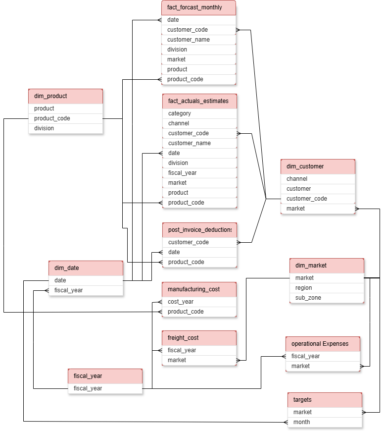

# Sales Insights Dashboard – Power BI

---

# 1. Background and Overview

## Project Background
Connect Technology is a global e-commerce company that sells popular hardware gadgets to customers worldwide through three primary sales channels: retailers, company-owned stores, and distributors.

Over time, the company has accumulated a large volume of data across multiple areas of the business, including finance, sales performance, marketing investments, supply chain operations, and strategic targets. However, much of this data has historically been underutilized for strategic decision-making.

This project develops a Business Insights 360° Power BI dashboard which analyzes and synthesizes the available data to uncover meaningful insights that can help improve Connect Technology's commercial performance and support data-driven business decisions.

The analysis focuses on identifying patterns, including sales targets, operational expenses, and market-level performance data, enabling a comprehensive evaluation of the company’s commercial and operational performance.

Insights and recommendations are provided across the following key areas:

- **Sales Trends Analysis:** Identification of revenue patterns, growth opportunities, and seasonal trends.
- **Product and Market Performance:** Evaluation of how different markets contribute to overall sales and profitability.
- **Marketing Investment Efficiency:** Analysis of advertising and promotional expenses across markets.
- **Financial Performance vs Targets:** Comparison of actual performance against defined business targets.

An interactive PowerBI dashboard can be downloaded here [link].
The SQL queries utilized to inspect and perform quality checks can be found [here link].
The SQL queries utilized to clean, organize, and prepare data for the dashboard can be found [here].
Targeted SQL queries regarding various business questions can be found [here].

## Project Objectives
The main objectives of this project are:

- Develop a **360° business intelligence dashboard** that integrates data from multiple business functions.
- Monitor **financial performance against company targets**, including Net Sales, Gross Margin, and Net Profit.
- Analyze **sales performance across markets and time periods** to identify growth opportunities.
- Evaluate **marketing expenses and promotional investments** to understand their impact on business performance.
- Provide **operational insights for supply chain efficiency**.
- Deliver a **high-level executive overview of key business KPIs** to support strategic decision-making.

---

# 2. Data Structure & Initial Checks
Connect Technology's database structure as seen below consists of twelve tables with a total row count of 5,811,576 records.

Prior to beginning the analysis, a variaty of checks were conductedfor quality control and familarization with the dataset.The SQL queries utilized to inspect and perform quality checks can be found [here/link]. 

---

# 3. Executive Summary

## Overview of Findings
[Provide a short summary of the most important insights]

Example placeholder text:

- Overall sales performance showed [trend].
- The top performing product category was [category].
- Certain regions showed stronger sales growth.

## Key Metrics

| Metric | Value |
|------|------|
| Total Sales | [Insert value] |
| Total Profit | [Insert value] |
| Profit Margin | [Insert value] |
| Total Orders | [Insert value] |

---

# 4. Insights Deep Dive

## Sales Performance

### Overview
[Explain overall sales trends]

### Visualization
_Insert dashboard screenshot_
